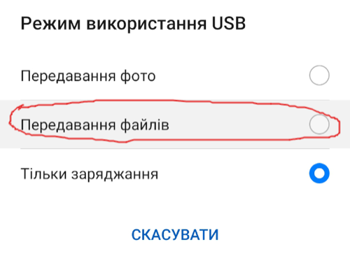
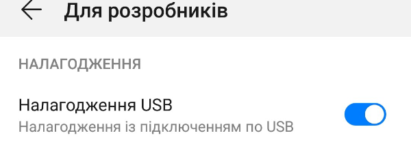
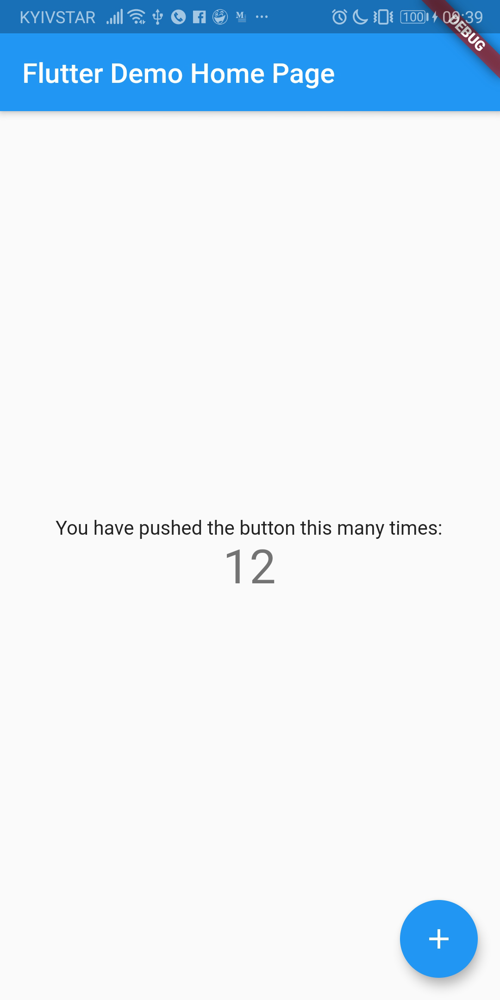
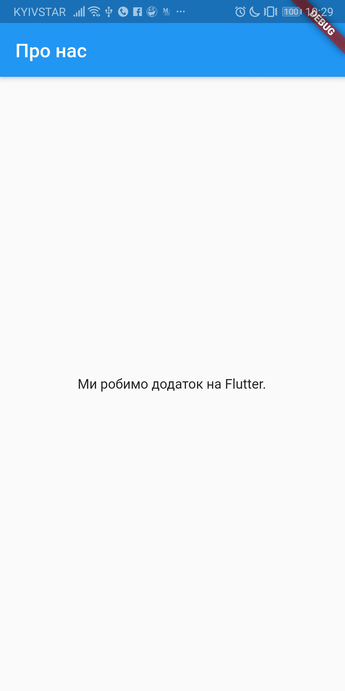
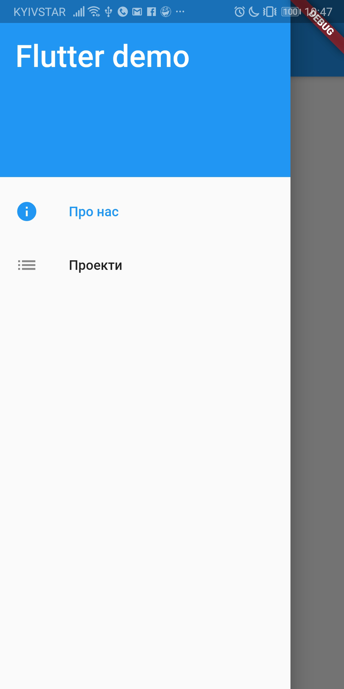
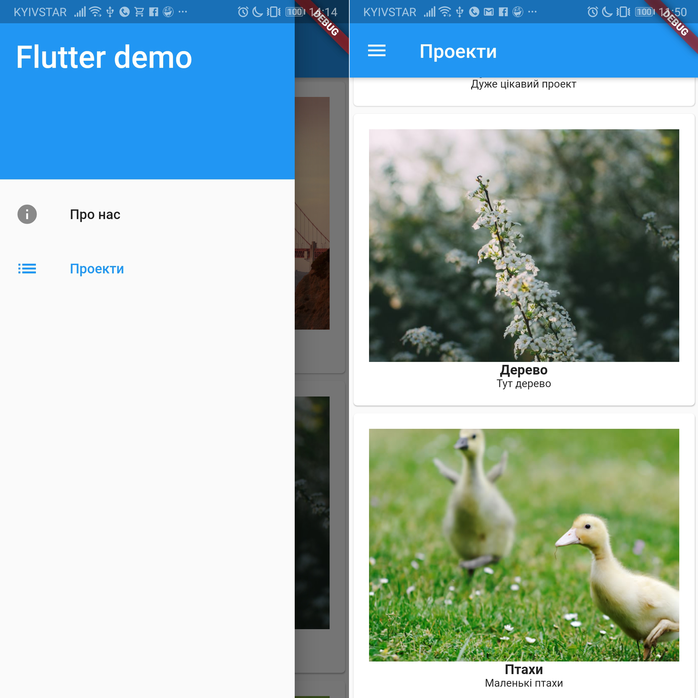
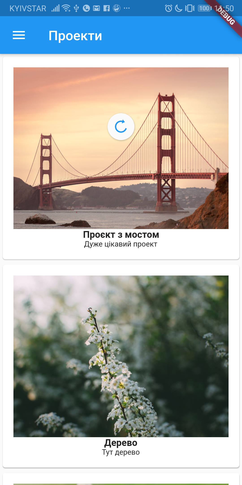

# Нативна та кросплатформова мобільна розробка з Flutter

## Як це працює

Колись розробка якісних мобільних додатків можлива була тільки якщо вона нативна. Тобто окремо під кожну платформу розроблявся додаток. Потім вигадали технології з додаванням вебу. Тобто додатки розроблялися за допомогою веб-технологій, а потім відображались за допомогою обгорток (wrappers) чи через WebView. Робота з API мобільних систем (камера, датчики тощо) також йшла через обгортки.

Потім з'явився `ReactNative`. Хоч UI там і нативний, але робота з ним теж через обгортки.

А от у фреймоврка Flutter від Google інший підхід. Там існує канвас і весь рендерінг працює через нього. Flutter вміє рендерити як `Material Design` (Android), так і `Cupertino` (iOS). Мова програмування — `Dart`.

А також, з недавнього часу, на `Flutter` можно зробити як [десктопний додаток](https://github.com/flutter/flutter/wiki/Desktop-shells), так і [веб-додаток](https://flutter.dev/web).

На даний момент доступна версія **Flutter 1.5**. Тому її і будемо використовувати.

## Встановлюємо Flutter

Скажу одразу про моє оточення. Я буду використовувати операційну систему `macOS`, підключу `Android`-девайс та буду на ньому запускати додаток. Але можно все це робити і на інших операційних системах (`GNU/Linux`, `Windows`) та запускати
на `iOS` чи взагалі на емуляторі.

Ще у інструкціі пропонують встановити `Android Studio`. Але я обійдусь без неї, мені достатньо `Visual Studio Code`.
Якщо ви будете використовувати `Android Studio` (чи `IntelliJ IDEA`), то можете скористатися офіційними інструкціями.
Посилання на них будуть далі.

### GNU/Linux

Є сторінка з інструкцією, де треба завантажити архів з `SDK`: https://flutter.dev/docs/get-started/install/linux.

Але я раджу спробувати встановити більш лінуксовим способом, тобто знайти `Flutter` десь у вашому репозиторію. Наприклад,
у операційній системі `ArchLinux` `Flutter` є у репозиторії `AUR`. Тому його можно встановити так:

```bash
yaourt -S flutter
```

Потім ще потрібно встановити `Android SDK`:

```bash
yaourt -S android-sdk
```

Та ще й SDK конкретної платформи з інструментами:

```bash
sdkmanager "platforms;android-28" "build-tools;28.0.3"
```

Це можна зробити і пізніше, коли будемо запускати наш перший додаток. Все одно без SDK він не запуститься, та нагадає про платформу `Android` та `build-tools`.

### macOS

І знову пропонують завантажити архів на офіційній сторінці: https://flutter.dev/docs/get-started/install/macos.

Проте якщо ви використовуєте `Homebrew`, то інсталювати можна так:

```bash
brew tap MiderWong/flutter
brew install flutter
```

Ще `Android SDK`:

```bash
brew install android-sdk
```

Та платформу з `build-tools`:

```bash
sdkmanager "platforms;android-28" "build-tools;28.0.3"
```

Ще потрібно додати змінну оточення з нашим `Android SDK` у файл `~/.bash_profile`:

```bash
export ANDROID_HOME=/usr/local/share/android-sdk
```

### Windows

Для `Window` думаю таки доведеться качати з офіційного сайту та виконувати все по інструкції:
https://flutter.dev/docs/get-started/install/windows.

## Налаштовуємо IDE

Як я вже казав, я використовую `Visual Studio Code`. Для неї є [інструкція на офіційному сайті](https://flutter.dev/docs/get-started/editor?tab=vscode).

Нам доведеться встановити розширення
[Flutter](https://marketplace.visualstudio.com/items?itemName=Dart-Code.flutter).
З ним встановиться й розширення `Dart` для відповідної мови програмування.

## Підключаємо девайс

Підключаємо за допомогою USB-кабелю. На девайсі повинен бути активований [режим розробника](https://www.google.com/search?q=android+developer+mode).

Коли підключили, то треба обрати режим `Передавання файлів`:



Також повинна бути увімкнена опція `Налагодження USB`:



Після підключення і увімкнення необхідних опцій, можемо перевірити чи є в нас підключені девайси:

```bash
flutter devices
```

Якщо є, то відповідь буде схожою на цю:

```
1 connected device:

FIG LX1 • XEDDU18B08001120 • android-arm64 • Android 9 (API 28)
```

Далі перевіримо чи все в нас є для роботи:

```bash
flutter doctor
```

У відповіді можуть бути попередження:

```
Doctor summary (to see all details, run flutter doctor -v):
[✓] Flutter (Channel stable, v1.5.4-hotfix.2, on Mac OS X 10.14.5 18F132, locale
    en-UA)
 
[✓] Android toolchain - develop for Android devices (Android SDK version 28.0.3)
[✗] iOS toolchain - develop for iOS devices
...
[!] Android Studio (not installed)
[✓] VS Code (version 1.35.1)
[✓] Connected device (1 available)

! Doctor found issues in 2 categories.
```

Тобто в мене не має оточення для `iOS` та `Android Studio`. Для першого я поки що не збираюсь збирати додаток, а без другого обійдусь. :)

Якщо `doctor` буде казати про неприйняті ліцензії для `Android`, то це можна зробити так:

```bash
flutter doctor --android-licenses
```

Доречі, ці команди вже можна буде не писати у консолі, а виконувати у IDE.

## Запускаємо наш перший додаток

Щоб запустити перший додаток спочатку створимо його:

```bash
flutter create flutter_demo
```

Тепер в нас є проект `flutter_demo`. Можемо відкрити його у `Visual Studio Code`.

Переходимо у директорію з проектом якщо ще не знаходимось там:

```bash
cd flutter_demo/
```

І одразу запускаємуо:

```bash
flutter run
```

Додаток збереться та завантажеться на девайс:



## Створюємо свій додаток з бекендом та... REST API

Що ж, давайте відкриємо головний файл `lib/main.dart` та подивимось що там. Так, це вже `Dart`.

Починається він з такого:

Спочатку ми імпортуємо пакет з гугловським `Material Design`. Саме звідти в нас будуть братися всї UI-віджети.

```dart
import 'package:flutter/material.dart';
```

Потім в нас йде функція `main`, яка і запускає наш додаток.

```dart
void main() => runApp(MyApp());
```

Сам клас додатка виглядає як `StatelessWidget`, у якому є початковий екран-віджет `MyHomePage`:

```dart
class MyApp extends StatelessWidget {
  // This widget is the root of your application.
  @override
  Widget build(BuildContext context) {
    return MaterialApp(
      title: 'Flutter Demo',
      theme: ThemeData(
        // ...
        primarySwatch: Colors.blue,
      ),
      home: MyHomePage(title: 'Flutter Demo Home Page'),
    );
  }
}
```

Взагалі, у `Flutter` є два основних типи віджетів:

- `StatelessWidget` — віджети без стану;
- `StatefulWidget` — віджети зі станом.

Наш домашній екран-віджет має стан. Бо у нього є лічильник. Тому він і має відповідний тип:

```dart
class MyHomePage extends StatefulWidget
```

Але я пропоную поки що не розбиратись у складному віджеті і зробити для початку простий, без стану, `StatelessWidget`
з текстом. Для цього прибираємо увесь код починаючи з:

```dart
class MyHomePage extends StatefulWidget
```

І до кінця.

## Початковий екран без стану

Зробимо наш початковий екран таким:

```dart
class MyHomePage extends StatelessWidget {
  @override
  Widget build(BuildContext context) {
    return Scaffold(
      appBar: AppBar(
        title: Text('Про нас'),
      ),
      body: Center(
        child: Text(
            'Ми робимо додаток на Flutter.',
          ),
      ),
    );
  }
}
```

У методі `build` ми віддаємо наш початковий віджет у декларативному вигляді. `Scaffold` — це базовий віджет для `Material Design`. В ньому ми розташували `AppBar` (хедер) з заголовком `Про нас` та контент з текстом у центрі.

Також змінимо запуск початкового віджету (приберемо зайвий `title`):

```dart
home: MyHomePage(title: 'Flutter Demo Home Page'),
```

На:

```dart
home: MyHomePage(),
```

Тепер можемо просто оновити наш додаток (`Hot reload`) натиснувши клавішу «`r`» у консолі, де запускали сам додаток.

Побачимо:



## Бокове меню

А зараз додамо гарне висувне бокове меню. У `Material Design` таке меню називається `Drawer`.
Наш віджет з меню назвемо `DrawerMain`. У цьому віджету буде стан — обраний пункт меню. Тому меню матиме тип `StatefulWdget`.

Пишемо код:

```dart
class DrawerMain extends StatefulWidget {
  DrawerMain({Key key, this.selected}) : super(key: key);

  final String selected;

  @override
  DrawerMainState createState() {
    return DrawerMainState();
  }
}

class DrawerMainState extends State<DrawerMain> {
  @override
  Widget build (BuildContext context) {
    return Drawer(
        child: ListView(
          padding: EdgeInsets.zero,
          children: <Widget>[
            DrawerHeader(
              child: Text(
                  'Flutter demo',
                  style: TextStyle(
                    color: Colors.white,
                    fontSize: 32.0,
                  ),
                ),
              decoration: BoxDecoration(
                color: Colors.blue,
              ),
            ),
            ListTile(
              selected: widget.selected == 'about',
              leading: Icon(Icons.info),
              title: Text('Про нас'),
              onTap: () {
                Navigator.pop(context);
                Navigator.push(
                  context,
                  MaterialPageRoute(builder: (context) => MyHomePage()),
                );
              },
            ),
            ListTile(
              selected: widget.selected == 'projects',
              leading: Icon(Icons.list),
              title: Text('Проекти'),
              onTap: () {
                Navigator.pop(context);
              },
            ),
          ]
        )
      );
  }
}
```

І додамо сам `Drawer` до нашого початкового екрану-віджету (з вказівкою який пункт меню обраний):

```dart
return Scaffold(
  // ...
  drawer: DrawerMain(selected: "about"),
  // ...
);
```

Головне тут — це те, що в нас є стан. Цей стан повертається методом `createState()`. Там знаходиться і наш віджет бокового меню. Стан нам необхідний щоб ми могли знати який пункт меню активний.
В самому меню є шапка у вигляді тексту (`DrawerHeader`), та два пункти (`ListTile`): `Про нас` та `Проекти`.

Коли ми тапаємо (натискаємо) по пункту (`ListTile`), то виникає подія `onTap`. А вже там ми ховаємо меню:

```dart
Navigator.pop(context);
```

Та переходимо до відповідного екрану:

```dart
Navigator.push(
  context,
  MaterialPageRoute(builder: (context) => MyHomePage()),
);
```

Поки що екрану з проектами в нас нема, тому на нього ще зарано переходити.

Оновлюєм:



## Отримаємо дані з REST API

Розробка повноцінного API вийде за рамки даної статті, тому я просто зробив JSON-файл і виклав його у
[github-репозиторіі](https://raw.githubusercontent.com/jhekasoft/flutter_demo/master/fake_api/project_list.json):

```json
[
    {
        "imageUrl": "https://raw.githubusercontent.com/jhekasoft/flutter_demo/master/fake_api/1.jpg",
        "title": "Проект з мостом",
        "shortDesc": "Дуже цікавий проект"
    },
    {
        "imageUrl": "https://raw.githubusercontent.com/jhekasoft/flutter_demo/master/fake_api/2.jpg",
        "title": "Дерево",
        "shortDesc": "Тут дерево"
    },
    {
        "imageUrl": "https://raw.githubusercontent.com/jhekasoft/flutter_demo/master/fake_api/3.jpg",
        "title": "Птахи",
        "shortDesc": "Маленькі птахи"
    }
]
```

У ньому знаходяться дані наших уявних проектів. Цей JSON нам треба буде розпарсити, то створюємо файл `lib/fetch_data/project.dart` з класом `Project`:

```dart
class Project {
  final String imageUrl;
  final String title;
  final String shortDesc;

  Project._({this.imageUrl, this.title, this.shortDesc});

  factory Project.fromJson(Map<String, dynamic> json) {
    return new Project._(
      imageUrl: json['imageUrl'],
      title: json['title'],
      shortDesc: json['shortDesc'],
    );
  }
}
```

Тут є необхідні поля і `Project.fromJson()` для парсингу даних.

Також нам знадобиться HTTP-клієнт, тому додамо його як залежність у `pubspec.yaml`:

```yaml
dependencies:
  # ...
  http: any
```

Далі повертаємось до `lib/main.dart` та вставляємо імпортування:

```dart
import 'package:flutter_demo/fetch_data/project.dart';
import 'package:http/http.dart' as http;
import 'package:flutter/scheduler.dart';
import 'dart:convert';
```

Тобто ми імпортували наш клас `Project` для `JSON`, клас `HTTP`-клієнта та два інших, які нам знадобляться для оновлення списку та для імпорту з `JSON`.

Далі напишемо наш екран-віджет з проектами:

```dart
class ProjectsPage extends StatefulWidget {
  @override
  _ProjectsPageState createState() => _ProjectsPageState();
}

class _ProjectsPageState extends State<ProjectsPage> {
  List<Project> list = List();
  final GlobalKey<RefreshIndicatorState> _refreshIndicatorKey = new GlobalKey<RefreshIndicatorState>();

  Future _fetchData() async {
    final response = await http.get(
      "https://raw.githubusercontent.com/jhekasoft/flutter_demo/master/fake_api/project_list.json"
    );
    if (response.statusCode == 200) {
      setState(() {
        list = (json.decode(response.body) as List)
          .map((data) => new Project.fromJson(data))
          .toList();
      });
    } else {
      throw Exception('Failed to load projects');
    }
  }

  @override
  void initState() {
    super.initState();
    SchedulerBinding.instance.addPostFrameCallback((_){  _refreshIndicatorKey.currentState?.show(); });
  }

  @override
  Widget build(BuildContext context) {
    return Scaffold(
      appBar: AppBar(
        title: Text('Проекти'),
      ),
      drawer: DrawerMain(selected: "projects"),
      body: RefreshIndicator(
        key: _refreshIndicatorKey,
        onRefresh: _fetchData,
        child: ListView.builder(
          itemCount: list.length,
          itemBuilder: (BuildContext context, int index) {
            return Card(
              child: Container(
                padding: EdgeInsets.all(16.0),
                child: Column(
                  children: <Widget>[
                    Image.network(
                      list[index].imageUrl,
                      fit: BoxFit.fitHeight,
                      width: 600.0,
                      height: 240.0,
                    ),
                    Text(
                      list[index].title,
                      style: TextStyle(fontSize: 14.0, fontWeight: FontWeight.bold),
                    ),
                    Text(
                      list[index].shortDesc,
                      style: TextStyle(fontSize: 11.0, fontWeight: FontWeight.normal),
                    ),
                  ],
                ),
              ),
            );
          },
        ),
      ),
    );
  }
}
```

Та додамо перехід на новий екран у бокове меню `Drawer`:

```dart
ListTile(
  selected: widget.selected == 'projects',
  leading: Icon(Icons.list),
  title: Text('Проекти'),
  onTap: () {
    Navigator.pop(context);
    Navigator.push(
      context,
      MaterialPageRoute(builder: (context) => ProjectsPage()),
    );
  },
),
```

Так як ми додавали нову залежність, то перезапустимо проект щоб подивитись що вийшло. Але тепер зробимо це з опцією `--profile`. Так в нас буде покращена анімація у віджетах, проте оновлювати додаток швидко за допомогою клавіші «`r`» ми не зможемо.

```bash
flutter run --profile
```

З'явився новий екран:



Екран з проектами — це `StatefulWidget`, тому що в нас присутній віджет `RefreshIndicator`, для якого використовується змінна-ключ `_refreshIndicatorKey`. Цей віджет потрібен для оновлення списку з проектами. Тобто ми можемо свайпнути екран до низу, а проекти оновляться!



Сам список складається з карток (`Card`), в яких є зображення (`Image.network`) та текст (`Text`). І ще вони знаходяться у віджетах `Container` та `Column`. Це нам потрібно щоб зробити прийнятний зовнішній вигляд.

Завантаження списку відбувається у методі `_fetchData()`. Ми декодуємо отриманий `JSON` та парсимо його у список `list` з `Project`. Також оновлення змінної `list` ми робимо всередині `setState()`. Це потрібно для реактивного оновлення, що віджет-екран оновився з новими даними.

А коли ми тільки потрапляємо на екран `ProjectsPage`, то виконується метод `initState()`. У ньому ми змушуємо оновити список за домопогою цієї стрічки:

```dart
SchedulerBinding.instance.addPostFrameCallback((_){  _refreshIndicatorKey.currentState?.show(); });
```

Також ви могли помітити такі речі з функціонального програмування, як тип `Future` та метод `map()`. Про них ви можете дізнатись на офіційному YouTube-каналі `Flutter`. Ось, наприклад [про Future](https://www.youtube.com/watch?v=OTS-ap9_aXc).

## Збираємо пакет APK для Android

Обов'язково перевірте, що у файлі `android/app/src/main/AndroidManifest.xml` вказані права для доступу до
інтернету:

```xml
<manifest>
    <!-- ... -->
    <uses-permission android:name="android.permission.INTERNET"/>
</manifest>
```

В мене чогось їх не було, тому неможливо було завантажити `JSON` з проектами.

А далі просто виконуйте:

```bash
flutter build apk
```

`APK`-файл буде знаходитись тут: `build/app/outputs/apk/release/app-release.apk`. Файл в мене займає **5,6 MB**.

Взагалі є [стаття на офіційному сайті](https://flutter.dev/docs/deployment/android) по релізу на `Android`.

## Висновки

Git-репозиторій проекту, яким ми сьогодні займались знаходиться [тут](https://github.com/jhekasoft/flutter_demo).

Я показав лише декілька екранів та бокове меню на `Flutter`. Також спробував дістати дані з мережі. І це виявилось не дуже складно. При цьому поки що я не побачив якихось складнощів.

Також мені сподобалась сама робота додатка. Вона досить плавна, виглядає досить нативно.

Сам розмір додатка поки що теж вразив. **5,6 МБ** — це не багато.

Як заявляє `Google` на [офіційному сайті](https://flutter.dev/showcase), `Flutter` вже використовують `Alibaba`, `Abbey Road Studios`, вони самі у додатку `Google Ads` та ща багато інших. Тому цей фреймворк чи навіть технологія здається перспективною.

Звісно, цікаво ще спробувати якісь більш системні речі. Наприклад, та ж камера, датчики, push-сповіщення тощо. Якщо стаття буде комусь цікава, то можливо я ще щось спробую зробити на `Flutter`. Особливо якщо будуть якісь побажання.
